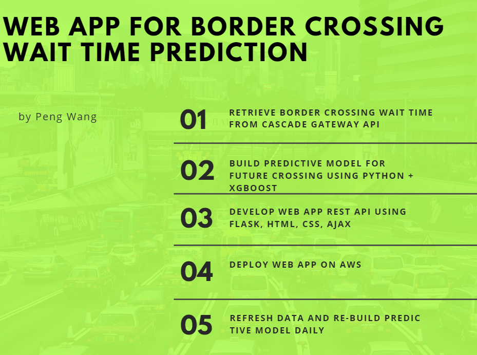

# Canada-US Border Crossing Wait Time Forecast Flask Web App


A Flask web app for Canada-US Border Crossing (Peace Arch Southbound) Wait Time Forecast.
We retrieve hourly border crossing records from [Whatcom Council of Governments](http://www.cascadegatewaydata.com/Crossing/)
and build predictive model using XGBoost to forecast wait time for the next 7 days. The last 7 days records 
are held out for model validation and RMSE is used for model evaluation.

Flask web app is hosted on AWS EC2 (free tier) with 1GB RAM. We had to give up on Facebook Prophet
due to its [requirement of minimum 4GB RAM](https://facebook.github.io/prophet/docs/installation.html).

Model is rebuilt daily using the new wait time records available from prior day.

## Install

After set up AWS EC2 instance, run the following in a terminal or command window

Clone GitHub project

1. ```git clone https://github.com/wangpengcn/border-crossing-delay-forecast-web-app-flask.git border_forecast```

Get into project folder

2. ```cd border_forecast```

Update script permission to allow read, write, and execute by current user

3. ```chmod 700 install.sh ```

Run script to install python, create virtual environment, install necessary packages, and schedule daily model rebuild

4. ```./install.sh```

## Code
- border_wait_time_forecast.py
- deployment/run_7_day_pred.py

## Run
```cd border_forecast/deployment```
```chmod 700 run_app.sh ```
```./run_app.sh```

## Data
Data collected from [Whatcom Council of Governments](http://www.cascadegatewaydata.com/Crossing/) since 2014.
It has hourly border crossing wait time records.

## Project workflow

